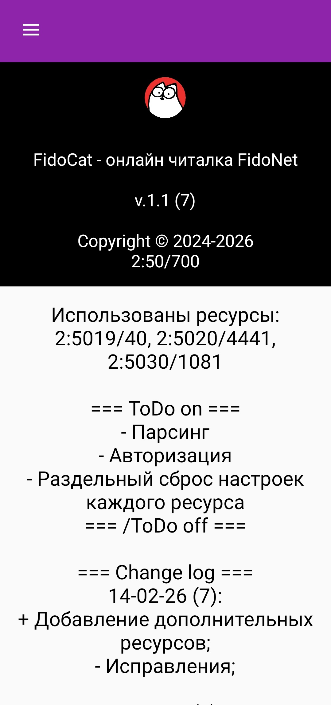
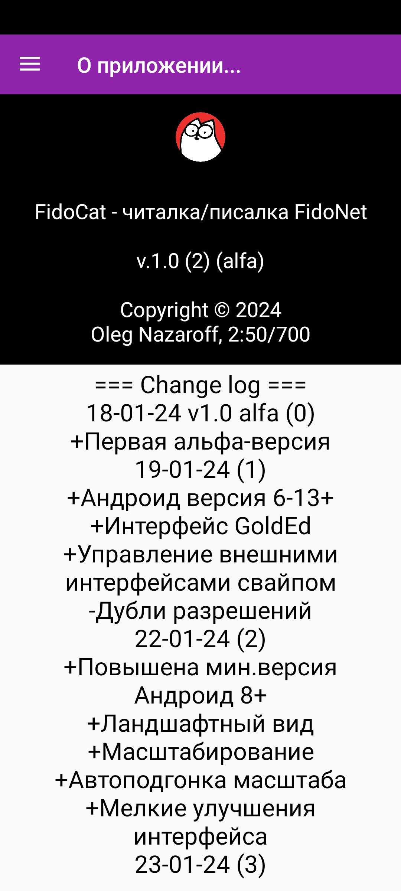
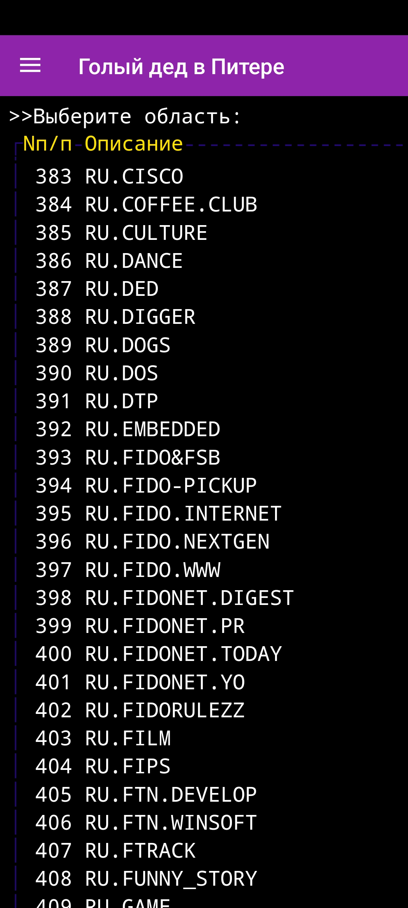
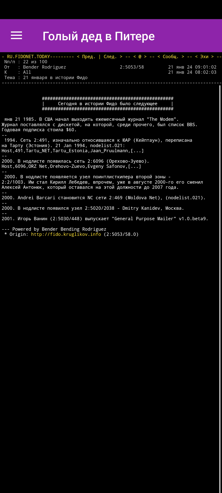
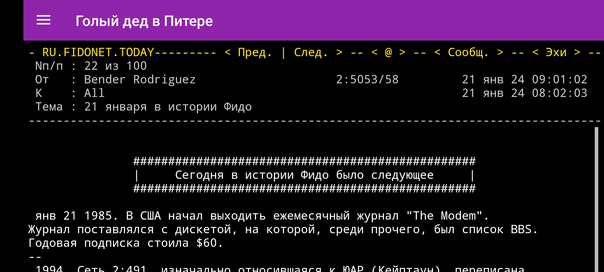

# FidoCat
FidoNet reader/writer for Android via different web-based interfaces like GoldEd, wFido etc.

## Features:

- [x] any Fido-interfaces in one
- [x] swipe management
- [x] auto-scale & zoom
- [x] Русский язык

### Screenshots

### Requirements
Android v8-18+

### Regards
Nil Alexandrov, 2:5015/46, for idea

Kostantin Kuzov, 2:5019/400, for GoldEd+ and another one custom web-interface

Anton Ryzhkov, 2:5030/1081, for GoldEd hosting

Dmitri Kamenski, 2:5023/24, for wFido hosting

Yuri Myakotin, 2:5020/4441, for custom web-interface

And all the fido-people, who sent bug reports.

### Known problems [fixed]
- [x] hangs of toasts
- [ ] some resource refreshes cause the app to freeze
